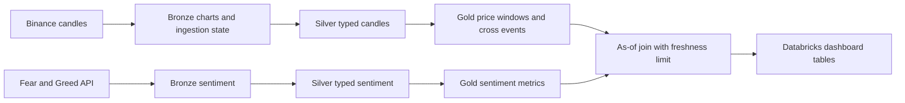

# Crypto Insight Dashboard

**English** | [한국어](README.ko.md)

A Databricks notebook pipeline that aligns four-hour cryptocurrency prices with
daily market sentiment using Spark and Delta Lake.

## Problem and scope

Price trends and the Fear & Greed Index arrive at different frequencies. This
project collects each source, normalizes timestamps and produces dashboard tables
with explicit freshness rules. Its portfolio role is data engineering: REST
ingestion, medallion layers, window calculations and temporal joins.

An earlier futures-position source was removed because it depended on an unofficial
paid gateway. The remaining pipeline has two sources; the legacy table name
`gold_price_positions_4h` does not mean position data is still collected.

## Architecture and decisions

| Choice | Reason and constraint |
|---|---|
| REST batch polling | Source endpoints and four-hour output do not require a continuously running stream; no streaming checkpoint is implemented |
| State tables and keyed MERGE | Track ingestion progress and update matching records on reruns; this needs live duplicate/failure validation |
| Separate trend and cross event | Bullish/Bearish is a state; a Golden/Dead Cross is emitted only on the corresponding transition |
| As-of sentiment join | Select the latest sentiment at or before bucket end per symbol and bucket; stale values become null |
| Databricks dashboard | Tables can be queried inside the workspace without a separate application server |

## Run in Databricks

Use a workspace with Unity Catalog permissions, Spark/Delta support and outbound
access to both APIs. These notebooks expect Databricks' `spark` session; they are
not standalone Python scripts. No cloud resources are provisioned by this repo.

1. Import the repository into a workspace Git folder and attach compute.
2. Set the same `CATALOG` and `SCHEMA` in every notebook; create those resources
   in a workspace you control.
3. Backfill both Bronze sources. For the first historical build, adjust Silver
   charts' default 14-day filter to cover the chosen Bronze history.
4. Run **both** Silver notebooks, then **both** Gold metric notebooks.
5. Run `pipeline/gold/joined_dashboard.ipynb`; it requires `gold_fear_greed`.
6. Inspect row counts, timestamp ranges and nulls before building dashboard views.

The [English operations guide](docs/operations.md) preserves parameters, table
names, SQL examples, maintenance and diagnosis. Original design notes remain in
[design](documentations/design.md) and [engineering lessons](documentations/technical_thought.md).

## Validation and limitations

Notebook Python cells were checked for syntax locally. **Databricks execution,
API ingestion, Delta MERGE behavior and dashboard results were not executed in
this refinement.** There is no automated pipeline test suite.

Moving averages use row windows and permit partial histories. Six preceding
four-hour rows only represent 24 hours when candles are complete. Sentiment
freshness uses calendar-day difference, rather than a precise 72-hour cutoff.
The temporal join is aligned to bucket end; it is not a leakage-free forecast or
validated trading backtest. Incomplete current candles need explicit handling.

Spark tuning settings are included, but no throughput, Photon speedup, cost or
investment-performance result has been reproduced. Cluster sizing must follow a
measured workload. Maintenance defaults include physical deletion; review the
operations guide before running that notebook.

Next work: synthetic Spark tests for repeat writes, missing candles, rolling-window
warmup and as-of joins; then record one workspace run with input counts, null
rates and query plans. Keep this a data pipeline rather than adding an AI layer.
